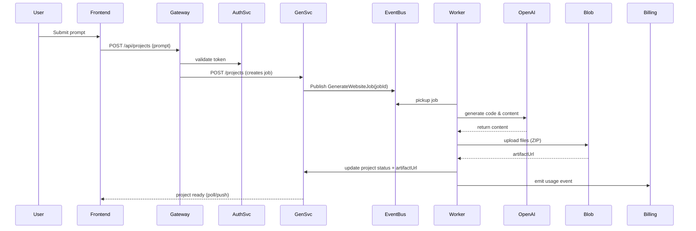

# TechBirdsFly Architecture — Mermaid Diagrams

## System Diagram

```mermaid
flowchart LR
  subgraph Frontend
    A[React SPA] -->|HTTP| G[API Gateway]
  end
  subgraph Services
    G --> Auth[Auth Service]
    G --> User[User/Profile Service]
    G --> Gen[Generator Service]
    G --> Img[Image Service]
    G --> Billing[Billing Service]
    G --> Admin[Admin Service]
  end
  subgraph Infra
    Gen --> Bus[Event Bus (RabbitMQ / Azure SB)]
    Gen --> Blob[Blob Storage]
    Img --> Blob
    Billing --> Stripe[Stripe]
    Auth --> AuthDB[(AuthDB)]
    User --> UserDB[(UserDB)]
    Billing --> BillingDB[(BillingDB)]
  end
```

## Sequence Diagram — Generate website


